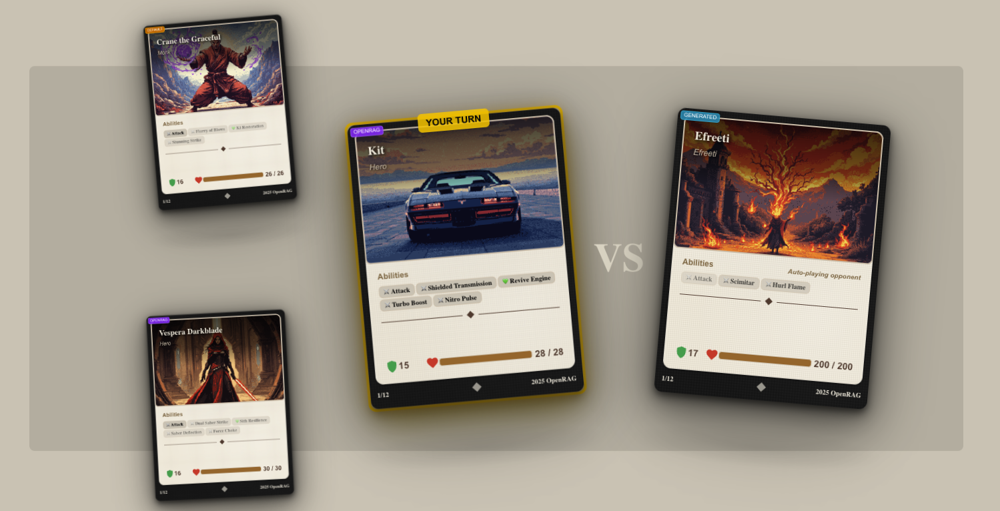
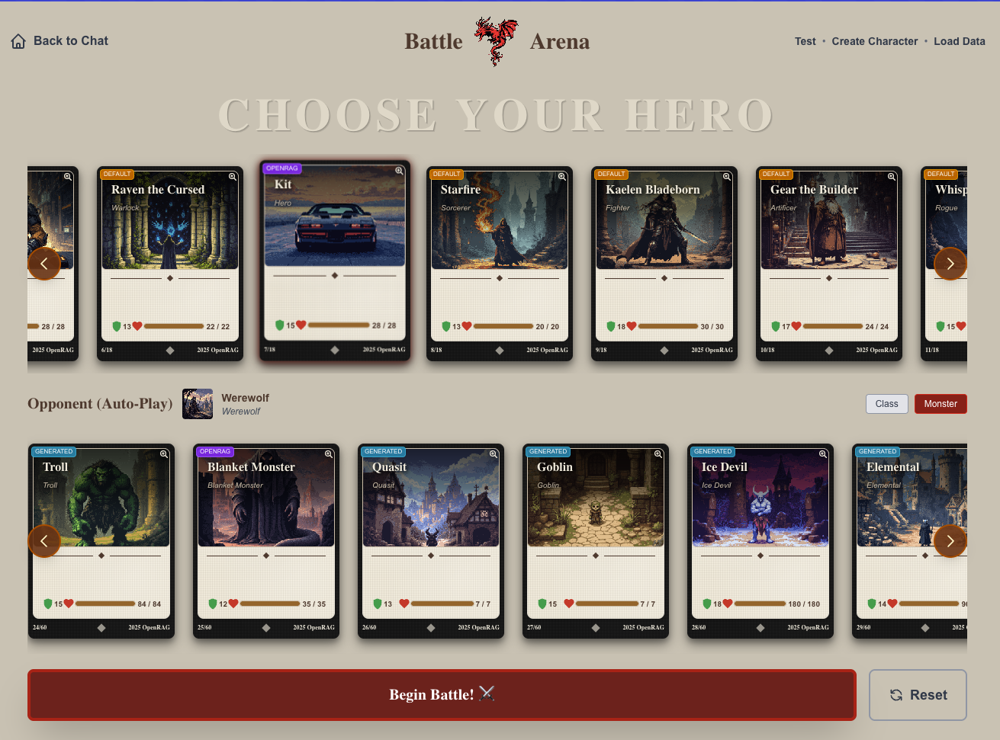
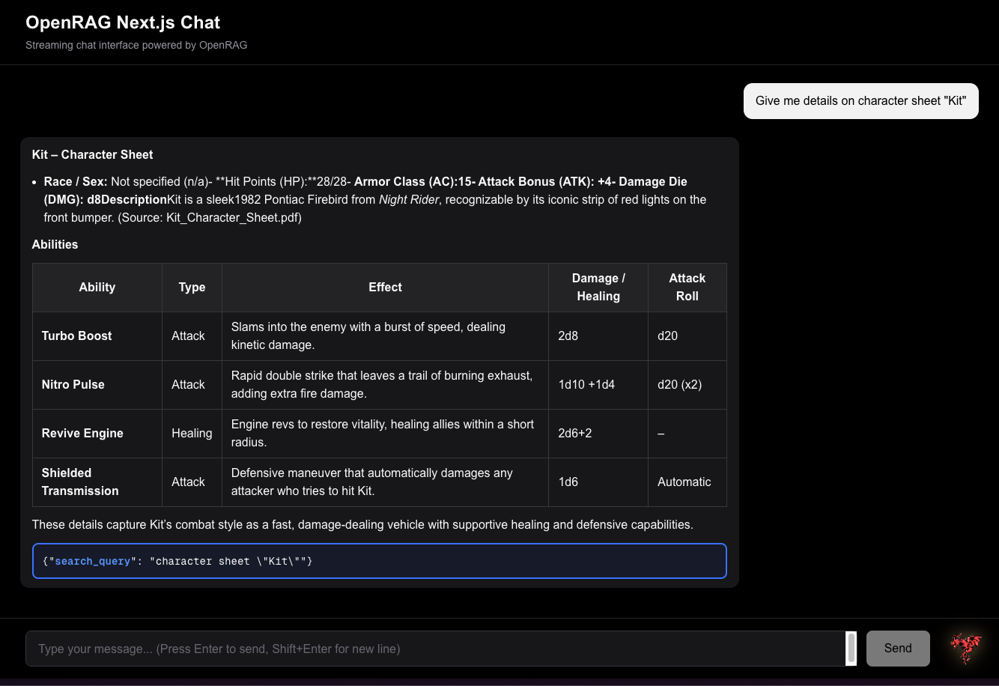
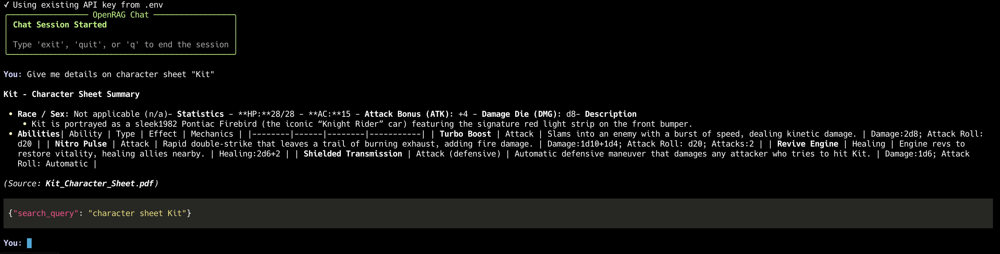

<div align="center">

# 🚀 OpenRAG Application Suite

### *Harness OpenRAG with Python chat, Web chat, and... Epic Battles?*

<table>
<tr>
<td width="33%" align="center">

<br/><b>⚔️ Battle Arena</b>
<br/><i>AI-Powered RPG Battles</i>
</td>
<td width="33%" align="center">

<br/><b>🎭 Character Creation</b>
<br/><i>Dynamic Hero & Monster Generation</i>
</td>
<td width="33%" align="center">

<br/><b>💬 RAG Chat Interface</b>
<br/><i>Streaming Conversations</i>
</td>
</tr>
</table>

[](https://github.com/langflow-ai/openrag)
[](https://python.org)
[](https://typescriptlang.org)
[](https://nextjs.org)
[](https://react.dev)

**A monorepo showcasing OpenRAG SDK integration across Python and TypeScript**

[Quick Start](#-quick-start) • [Applications](#-choose-your-adventure) • [Documentation](#-documentation)

</div>

---

## 🎯 What's This All About?

This monorepo provides implementation examples using the **OpenRAG SDK** through three distinct applications:

1. **💬 Python Chat** - Simple terminal-based RAG conversations with streaming responses
2. **🌐 TypeScript Web Chat** - Next.js web interface for RAG interactions
3. **⚔️ Battle Arena** - A deck battler where (you + AI) generate heroes and monsters, then battle them

---

## 🎮 Choose Your Adventure

### 💬 Python Chat

**For terminal enthusiasts and Python developers**


Chat with your OpenRAG agent directly from the command line. Features streaming responses, rich markdown rendering, and an example OpenRAG SDK utility library.

```bash
cd python
uv sync
uv run python main.py
```

**Perfect for:**
- Quick OpenRAG testing and experimentation
- Python SDK integration examples

📖 **[Python Documentation](python/README.md)**

---

### 🌐 TypeScript Web Chat

**For web developers and folks coding TypeScript**


A responsive Next.js 16 application with real-time streaming, markdown rendering, and a clean interface. Built with App Router and React Server Components.

```bash
cd typescript
npm install
npm run dev
```

Open [http://localhost:3000](http://localhost:3000) to start chatting!

**Perfect for:**
- Web-based RAG applications
- Learning Next.js + OpenRAG integration
- TypeScript SDK examples

📖 **[Typescript Documentation](typescript/README.md)**

---

### ⚔️ Battle Arena
**For the adventurous**


A deck battler using OpenRAG to generate characters from PDFs or text descriptions, and narrate epic battles. Watch heroes and monsters clash!

```bash
cd typescript
npm install
npm run dev
```

Navigate to [http://localhost:3000/battle-arena](http://localhost:3000/battle-arena)

**Perfect for:**
- Having a bit of fun
- Document ingestion examples (character sheets)
- Document export to OpenRAG
- Using Search
- OpenRAG SDK usage in TypeScript

📖 **[Typescript Documentation](typescript/README.md)**

---

## 🏗️ Architecture

All three applications share a common pattern: they use dedicated `openrag-utils` libraries that wrap the OpenRAG SDK for cleaner, more maintainable code. 

Whether you do this or not is totally up to you. If you'd like to roll your own check out the [Python SDK docs](https://github.com/langflow-ai/openrag/blob/main/sdks/python/README.md) or the [TypeScript SDK docs](https://github.com/langflow-ai/openrag/blob/main/sdks/typescript/README.md).

```
┌─────────────────────────────────────────────────────────────┐
│                     OpenRAG Backend                         │
│  (Document Storage, Embeddings, LLM Integration)            │
└─────────────────────────────────────────────────────────────┘
                             ▲
                             │ OpenRAG SDK
                 ┌───────────┼───────────┐
                 │           │           │
         ┌───────▼─────┐ ┌──▼────────┐ ┌▼──────────────┐
         │   Python    │ │TypeScript │ │  TypeScript   │
         │  CLI Chat   │ │ Web Chat  │ │ Battle Arena  │
         │             │ │           │ │               │
         │ openrag_    │ │ openrag-  │ │ openrag-      │
         │ utils/      │ │ utils/    │ │ utils/        │
         └─────────────┘ └───────────┘ └───────────────┘
```

### The `openrag-utils` Pattern

Both Python and TypeScript apps include utility libraries that:

- ✅ Wrap all OpenRAG SDK endpoints
- ✅ Provide consistent APIs across languages
- ✅ Include usage examples and tests
- ✅ Can be used standalone or imported

**Python:** `python/openrag_utils/`
**TypeScript:** `typescript/lib/openrag-utils/`

### Project Structure

```
openrag-langflow-app/
├── .env                         # Environment variables (shared by all apps)
├── .env.example                 # Template for environment variables
├── README.md                    # This file
│
├── python/                      # Python CLI Chat
│   ├── main.py
│   ├── config.py
│   ├── openrag_utils/           # Python SDK utilities
│   └── README.md
│
├── typescript/                  # TypeScript applications
│   ├── app/
│   │   ├── chat/                # Web Chat interface
│   │   └── battle-arena/        # Battle Arena game
│   ├── lib/
│   │   └── openrag-utils/       # TypeScript SDK utilities
│   └── README.md
│
└── docs/                        # Documentation and images
```

**Note:** All applications share a single `.env` file in the root directory.

---

## 🚀 Quick Start

### Prerequisites

- **Python 3.13+** (for Python CLI)
- **Node.js 18.18+** (for TypeScript apps)
- **OpenRAG Server** running (default: http://localhost:3000)
- **OpenRAG API Key**

### Installation

```bash
# Clone the repository
git clone <repository-url>
cd openrag-langflow-app

# Create .env file in the root directory
cp .env.example .env
# Edit .env and add your OPENRAG_API_KEY

# Setup Python CLI
cd python
uv sync
uv run python main.py

# Setup TypeScript apps (in a new terminal)
cd typescript
npm install
npm run dev
```

### Environment Variables

Create a `.env` file in the **root directory** of the project (not in subdirectories):

```bash
# Required
OPENRAG_API_KEY=orag_your_api_key_here

# Optional
OPENRAG_URL=http://localhost:3000

# Battle Arena only (optional)
EVERART_API_KEY=your_everart_key
ASTRA_DB_APPLICATION_TOKEN=your_token
ASTRA_DB_ENDPOINT=your_endpoint
```

**Note:** All applications (Python CLI, TypeScript Chat, and Battle Arena) read from the same root `.env` file. You can use the provided `.env.example` as a template.

---

## 🔧 OpenRAG SDK Integration

### Python Example

```python
from openrag_utils import chat_streaming, search_query, ingest_document

# Streaming chat
async for event in chat_streaming("What is RAG?", "chat-123"):
    if event["type"] == "content":
        print(event["content"], end="", flush=True)

# Document search
results = await search_query("machine learning", limit=5)

# Document ingestion
await ingest_document("./docs/guide.pdf", wait=True)
```

### TypeScript Example

```typescript
import { chatStreaming, searchQuery, ingestDocument } from '@/lib/openrag-utils';

// Streaming chat
for await (const event of chatStreaming('What is RAG?', 'chat-123')) {
  if (event.type === 'content') {
    process.stdout.write(event.content);
  }
}

// Document search
const results = await searchQuery('machine learning', 5);

// Document ingestion
await ingestDocument({ file: pdfFile, wait: true });
```

---

## 📚 Documentation

### Application Guides
- **[Python CLI Chat](python/README.md)** - Terminal chat interface and SDK utilities
- **[TypeScript Applications](typescript/README.md)** - Web Chat, Battle Arena, and SDK utilities

### External Resources
- **[OpenRAG GitHub](https://github.com/langflow-ai/openrag)** - Official OpenRAG repository
- **[Next.js Documentation](https://nextjs.org/docs)** - Next.js framework docs

---

## 🐛 Troubleshooting

### Connection Issues

Make sure your OpenRAG server is running:
```bash
curl http://localhost:3000/health
```

### API Key Issues

Verify your API key in `.env`:
```bash
cat .env | grep OPENRAG_API_KEY
```

### Dependency Issues

```bash
# Python
cd python && uv sync

# TypeScript
cd typescript && npm install
```

---

## 📄 License

This project is provided as-is for demonstration purposes.

---

<div align="center">

**Built with ❤️ using the OpenRAG SDK**

*Three apps, one SDK, infinite possibilities* 🚀

[Get Started](#-quick-start) • [View on GitHub](https://github.com/langflow-ai/openrag)

</div>
